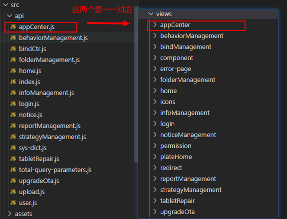
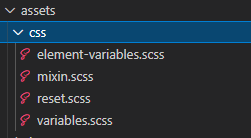
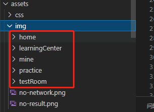
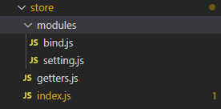
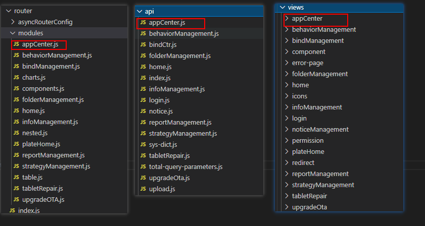

# gfy-pc-template

## 介绍

> 这是一篇关于 `vue2x` PC 端基础框架的使用文档，本框架以 `vue全家桶+element` 为基础进行搭建的，包括且不限于 `vue+vue-router+vuex+axios+element` 等核心包。

## 功能

- axios 的二次封装，模块化处理
- vuex 模块化处理、刷新消失问题处理
- filter 全局过滤文件
- 全局自定义 loading 组件集成
- element-message 问题解决方案集成
- svg 用法集成
- 路由模块化及权限处理
- element 全局 css 分类封装，包括（element-variables.scss、mixin.scss、reset.scss、variables.scss 等）
- 多环境打包配置，development、sit、production
- 打包优化，代码压缩，图片压缩，去掉打包之后的打印（可选）
- md5 加密方法集成，全局引入
- Excel导出功能

备注：

> 其他内容可按照项目需求、按需引入

## 安装

```sh
#克隆
git clone https://github.com/web-vue-template/web-pc-template.git

#进入gfy-pc-template文件夹
cd gfy-pc-template

#下载
npm install

#启动
npm run serve

#访问
http://localhost:8080

#打包集成环境
npm run sit

#打包正式环境
npm run build
```

## 目录结构

```bash
├── public                     # 静态资源
│   │── favicon.ico            # favicon图标
│   └── index.html             # html模板
├── src						   # 源代码
│   ├── api                    # 所有请求
│   ├── assets                 # css img等静态资源
│   ├── components             # 全局公用组件
│   ├── filters                # 全局 filter
│   ├── icons                  # 项目所有 svg icons
│   ├── router                 # 路由
│   ├── store                  # 全局 store管理
│   ├── utils                  # 全局公用方法
│   ├── views                  # views 所有页面
│   ├── App.vue                # 入口页面
│   ├── main.js                # 入口文件 加载组件 初始化等
│   └── permission.js          # 权限管理
├── .browserslistrc
├── .editorconfig
├── .env.development           # 本地环境
├── .env.production            # 正式环境
├── .env.sit                   # 集成环境
├── .eslintrc.js               # eslint 配置项
├── .postcssrc.js
├── babel.config.js
├── package-lock.json
├── package.json
├── README.md
└── vue.config.js
```

## src 目录

### api

> 接口请求文件

- 所有的接口请求，需要按照模块划分，写在`/src/api`文件夹；
- `/src/api/index.js`：用于存放公共的接口，例如上传图片，请求学校列表、班级列表等；
- `/src/api/xxx.js`：自己按照模块去划分的接口，不过要与`views`里面的模块一一对应；



#### 示例：

- /src/api/index.js

```js
import axios from '../utils/request'
import * as qs from 'qs'
// 查询班级
export const getSchoolClass = (params) => {
  return axios.post(`school/getSchoolClass`, qs.stringify(params))
}
```

- `/src/views/About.vue`(请求示例)

```vue
<script>
import { getSchoolClass } from '@/api'
export default {
  methods: {
    // 查询班级筛选条件
    getBelongClassOptions(val) {
      let obj = {
        schoolId: 24,
      }
      let params = {
        requestJson: JSON.stringify(obj),
      }
      console.log(obj)
      getSchoolClass(params).then((r) => {
        if (r.totalNum > 0) {
          let arr = r.data[0].SchoolClassVo
          console.log('arr', arr)
        }
      })
    },
  },
  mounted() {
    this.getBelongClassOptions()
  },
}
</script>
```

### assets

> 静态文件夹，存放 images、css 等文件

#### css

> 路径： `/src/assets/css` ，一共分为以下四类

- `element-variables.scss`：element 主题修改
- `mixin.scss`：全局公共 css，以及方法
- `reset.scss`：覆盖 UI 的 css
- `variables.scss`：全局变量，颜色字体大小等



#### images

> 存放静态图片，需要按照模块去划分



#### components

> 全局公共组件，存放可复用的全局组件，如果只是当前页面用到，存在 `/src/views/xxx` 对应的模块下面就好

##### 命名规范：

- 文件夹形式建组件，例如`/src/Loading/index.vue`
- 首字母大写，例如`Loading`

### filters

> 全局过滤文件，只有全局用到的存放这里，如果单个页面用到的，用 `filter` 写在自己的页面就好了

#### 示例：

- `/src/filters/index.js`

```js
const getGradeName = function(grade) {
  let gradeName = '其他'
  switch (grade) {
    case 'G01':
      gradeName = '一年级'
      break
    case 'G02':
      gradeName = '二年级'
      break
    case 'G03':
      gradeName = '三年级'
      break
    case 'G04':
      gradeName = '四年级'
      break
    case 'G05':
      gradeName = '五年级'
      break
    case 'G06':
      gradeName = '六年级'
      break
    case 'G07':
      gradeName = '初一'
      break
    case 'G08':
      gradeName = '初二'
      break
    case 'G09':
      gradeName = '初三'
      break
    case 'G10':
      gradeName = '高一'
      break
    case 'G11':
      gradeName = '高二'
      break
    case 'G12':
      gradeName = '高三'
      break
  }
  return gradeName
}
export { getGradeName }
```

- `/src/views/About.vue`

```html
<span>{{'G12' | getGradeName}}</span>
```

### icons

> svg 文件存放目录

#### 命名规范：

> 需要语义化，请看一下 loading 示例

- `icon-xxx.svg`，例如`icon-loading.svg`

#### 使用方法：

```html
//icon-class为svg的名字 <svg-icon icon-class="icon-loading" />
```

### router

> 路由文件存放目录；

- `modules`：路由模块目录
- `index.js`：路由汇总引入文件

> 这里的路由分为两种， `constantRoutes` 和 `asyncRoutes` 。
>
> **constantRoutes：** 代表那些不需要动态判断权限的路由，如登录页、404、等通用页面。
>
> **asyncRoutes：** 代表那些需求动态判断权限并通过 `addRoutes` 动态添加的页面。

#### 示例：

- `/src/router/modules/demoRouter.js`

```js
const demoRouter = {
  path: '/About',
  name: 'About',
  component: () => import('@/views/About'),
  meta: {
    title: 'demo',
  },
}
export default demoRouter
```

- `/src/router/index.js`

```js
import Vue from 'vue'
import Router from 'vue-router'

Vue.use(Router)
import demoRouter from './modules/demoRouter'

/**
 * constantRoutes
 * 不需要权限验证的
 */
export const constantRoutes = [
  {
    path: '/',
    name: 'Home',
    component: () => import('@/views/Home.vue'),
    meta: {
      title: '首页',
      roles: ['admin'], // or you can only set roles in sub nav
    },
  },
  demoRouter,
  // {
  //   path: '/about',
  //   name: 'About',
  //   component: () => import('../views/About.vue')
  // }
]

/**
 * asyncRoutes
 * 需要权限验证的
 */
export const asyncRoutes = []

const createRouter = () =>
  new Router({
    // mode: 'history', // require service support
    scrollBehavior: () => ({
      y: 0,
    }),
    routes: constantRoutes,
  })

const router = createRouter()

export function resetRouter() {
  const newRouter = createRouter()
  router.matcher = newRouter.matcher // reset router
}

export default router
```

### store

> `vuex` 存放目录，本框架已经做了自动导入，无需手动在 `index.js` 手动引入；
>
> 这里引入了一个插件([vuex-persistedstate](https://www.jianshu.com/p/7fb432e7594e))，用于解决 vuex 刷新消失问题，详细可以进入链接查看

- `modules`：vuex 模块存放目录

- `getters.js`：获取 vuex 数据

- `index.js`：vuex 模块化汇总引入



#### 示例;

- `/src/modules/bind.js`

```js
const state = {
  bindFilter: '', //筛选条件缓存
  detailRouter: false,
}

const mutations = {
  bindFilter_Fun: (state, data) => {
    state.bindFilter = data
  },
  detailRouter_Fun: (state, data) => {
    state.detailRouter = data
  },
}

const actions = {
  bindFilter({ commit, state }, data) {
    commit('bindFilter_Fun', data)
  },
  detailRouter({ commit, state }, data) {
    commit('detailRouter_Fun', data)
  },
}

export default {
  namespaced: true,
  state,
  mutations,
  actions,
}
```

- `/src/getters.js`

```js
const getters = {
  // 绑定管理筛选数据
  getBindFilter: (state) => state.bind.bindFilter,
  getDetailRouter: (state) => state.bind.detailRouter,
  getIsLoading: (state) => state.setting.isLoading, //是否显示loading
}
export default getters
```

- `/src/modules/index.js`

> 需要换成的数据直接放在 return 下面，不需要缓存的不写就好了

```js
import Vue from 'vue'
import Vuex from 'vuex'
import getters from './getters'
// import createVuexAlong from 'vuex-along'
import createPersistedState from 'vuex-persistedstate'
Vue.use(Vuex)

// https://webpack.js.org/guides/dependency-management/#requirecontext
const modulesFiles = require.context('./modules', true, /\.js$/)

// you do not need `import app from './modules/app'`
// it will auto require all vuex module from modules file
const modules = modulesFiles.keys().reduce((modules, modulePath) => {
  // set './app.js' => 'app'
  const moduleName = modulePath.replace(/^\.\/(.*)\.\w+$/, '$1')
  const value = modulesFiles(modulePath)
  modules[moduleName] = value.default
  return modules
}, {})

const store = new Vuex.Store({
  plugins: [
    createPersistedState({
      storage: window.localStorage,
      reducer(val) {
        return {
          // 需要储存的数据
          bind: val.bind,
        }
      },
    }),
  ],
  modules,
  getters,
})

export default store
```

### untils

> 存放工具函数的目录，例如 `md5.js` 、 `request.js`

#### request.js

> axios 封装处理

```js
import Vue from 'vue'
import axios from 'axios'
import { message } from '@/utils/resetMessage'
import store from '../store'
const baseUrl = process.env.VUE_APP_BASE_URL
let loading_count = 0 //请求计数器

function startLoading() {
  if (loading_count == 0) {
    store.dispatch('showLoading', true)
  }
  //请求计数器
  loading_count++
}

function endLoading() {
  loading_count-- //只要进入这个函数，计数器就自减，直到。。
  if (loading_count <= 0) {
    store.dispatch('showLoading', false)
  }
}

// axios.defaults.baseURL = baseUrl;
// axios.defaults.withCredentials = false;
// axios.defaults.timeout = 6000;
const service = axios.create({
  baseURL: baseUrl, // url = base api url + request url
  withCredentials: false, // send cookies when cross-domain requests
  timeout: 6000, // request timeout
})

// Add a request interceptor
service.interceptors.request.use(
  (config) => {
    if (config.url.indexOf('?') < 0) {
      config.url = config.url + '?t=' + new Date().getTime().toString()
    } else {
      config.url = config.url + '&t=' + new Date().getTime().toString()
    }
    startLoading()

    return config
  },
  (error) => {
    endLoading()
    // Do something with request error
    return Promise.reject(error)
  }
)

// Add a response interceptor
service.interceptors.response.use(
  (response) => {
    // store.dispatch('showLoading', false)
    endLoading()
    return response.data
  },
  (error) => {
    if (error && error.response) {
      switch (error.response.status) {
        case 400:
          error.message = '请求错误(400)'
          break
        case 401:
          return history.push('/login')
          break
        case 403:
          error.message = '拒绝访问(403)'
          break
        case 404:
          error.message = '请求出错(404)'
          break
        case 408:
          error.message = '请求超时(408)'
          break
        case 500:
          error.message = '服务器错误(500)'
          break
        case 501:
          error.message = '服务未实现(501)'
          break
        case 502:
          error.message = '网络错误(502)'
          break
        case 503:
          error.message = '服务不可用(503)'
          break
        case 504:
          error.message = '网络超时(504)'
          break
        case 505:
          error.message = 'HTTP版本不受支持(505)'
          break

        default:
          error.message = `连接出错(${error.response.status})!`
      }
      // Toast(error.message);
      message({
        message: error.message,
        type: 'error',
        duration: 3 * 1000,
      })
    } else {
      error.message = '网络异常，请稍后重试'
    }

    // Toast(error.message);
    message({
      message: error.message,
      type: 'error',
      duration: 3 * 1000,
    })
    endLoading()
    return Promise.reject(error)
  }
)
export default service
```

#### resetMessage.js

> 解决 element-message 弹出多次问题

```js
/**重置message，防止重复点击重复弹出message弹框 */
import { Message } from 'element-ui'
let messageInstance = null
const resetMessage = (options) => {
  if (messageInstance) {
    messageInstance.close()
  }
  messageInstance = Message(options)
}
;['error', 'success', 'info', 'warning'].forEach((type) => {
  resetMessage[type] = (options) => {
    if (typeof options === 'string') {
      options = {
        message: options,
      }
    }
    options.type = type
    return resetMessage(options)
  }
})
export const message = resetMessage
```

##### 使用方法：

> `.vue`中正常使用，js稍有不同

- js 文件使用

```js
import { message } from '@/utils/resetMessage'

message({
  message: error.message,
  type: 'error',
  duration: 3 * 1000,
})
```

### views

> 页面组件存放目录；
>
> 需注意，只有当前模块用到的存放在自己的`/src/views/Demo/components/`里面就好了，如果多复用的，需存放在`/src/compontens/`里面

#### 规范

- 命名规范
  - 驼峰命名、首字母大写
  - 有意义的: 不过于具体，也不过于抽象
  - 简短: 2 到 3 个单词、首字母大写
  - 具有可读性: 以便于沟通交流

例如：

```
components/
|- Loading.vue

views/
|- AppCenter
	|- appDetails.vue
```

- 与`router`、`api`等要一一对应



### permission.js

> 权限控制、路由拦截器;
>
> 暂时只做了白名单控制，动态路由需要优化进去

```js
import router from './router'
import store from './store'
import { Message } from 'element-ui'
import NProgress from 'nprogress' // progress bar
import 'nprogress/nprogress.css' // progress bar style
import { getToken } from '@/utils/auth' // get token from cookie
import getPageTitle from '@/utils/get-page-title'

NProgress.configure({ showSpinner: false }) // NProgress Configuration

const whiteList = ['/', '/home','/about', '/login', '/auth-redirect'] // no redirect whitelist

router.beforeEach(async (to, from, next) => {
  // start progress bar
  NProgress.start()

  // set page title
  document.title = getPageTitle(to.meta.title)

  // determine whether the user has logged in
  const hasLogin = store.getters.getHasLogin

  if (hasLogin) {
    if (to.path === '/login') {
      // if is logged in, redirect to the home page
      next({ path: '/' })
      NProgress.done() // hack: https://github.com/PanJiaChen/vue-element-admin/pull/2939
    } else {
      // determine whether the user has obtained his permission roles through getInfo
      // const hasRoles = store.getters.roles && store.getters.roles.length > 0
      // if (hasRoles) {
      //   next()
      // } else {
      //   try {
      //     // get user info
      //     // note: roles must be a object array! such as: ['admin'] or ,['developer','editor']
      //     const { roles } = await store.dispatch('user/getInfo')

      //     // generate accessible routes map based on roles
      //     const accessRoutes = await store.dispatch('permission/generateRoutes', roles)

      //     // dynamically add accessible routes
      //     router.addRoutes(accessRoutes)

      //     // hack method to ensure that addRoutes is complete
      //     // set the replace: true, so the navigation will not leave a history record
      //     next({ ...to, replace: true })
      //   } catch (error) {
      //     // remove token and go to login page to re-login
      //     await store.dispatch('user/resetToken')
      //     Message.error(error || 'Has Error')
      //     next(`/login?redirect=${to.path}`)
      //     NProgress.done()
      //   }
      // }
    }
  } else {
    /* has no token*/

    if (whiteList.indexOf(to.path) !== -1) {
      // 在白名单里面，可以直接访问
      next()
    } else {
 	//其他有权限的，但是需要登录才能访问的
      next(`/login?redirect=${to.path}`)
      NProgress.done()
    }
  }
})

router.afterEach(() => {
  // finish progress bar
  NProgress.done()
})

```

### settings.js

> 全局配置文件，现在只用了`title`字段

```js
module.exports = {
  title: 'gfy-pc-template',

  /**
   * @type {boolean} true | false
   * @description Whether show the settings right-panel
   */
  showSettings: true,

  /**
   * @type {boolean} true | false
   * @description Whether need tagsView
   */
  tagsView: true,

  /**
   * @type {boolean} true | false
   * @description Whether fix the header
   */
  fixedHeader: false,

  /**
   * @type {boolean} true | false
   * @description Whether show the logo in sidebar
   */
  sidebarLogo: false,

  /**
   * @type {string | array} 'production' | ['production', 'development']
   * @description Need show err logs component.
   * The default is only used in the production env
   * If you want to also use it in dev, you can pass ['production', 'development']
   */
  errorLog: 'production'
}

```

## Excel

### Excel 导出

Excel 的导入导出都是依赖于[js-xlsx](https://github.com/SheetJS/js-xlsx)来实现的。

在 `js-xlsx`的基础上又封装了[Export2Excel.js](https://github.com/PanJiaChen/vue-element-admin/blob/master/src/vendor/Export2Excel.js)来方便导出数据。

### 使用

由于 `Export2Excel`不仅依赖`js-xlsx`还依赖`file-saver`和`script-loader`。

所以你先需要安装如下命令：

> 此处已经安装，无需安装

```bash
npm install xlsx file-saver -S
npm install script-loader -S -D
```

由于`js-xlsx`体积还是很大的，导出功能也不是一个非常常用的功能，所以使用的时候建议使用懒加载。使用方法如下：

```js
import('@/vendor/Export2Excel').then(excel => {
  excel.export_json_to_excel({
    header: tHeader, //表头 必填
    data, //具体数据 必填
    filename: 'excel-list', //非必填
    autoWidth: true, //非必填
    bookType: 'xlsx' //非必填
  })
})
```

### 参数

| 参数      | 说明                   | 类型    | 可选值                                                       | 默认值     |
| --------- | ---------------------- | ------- | ------------------------------------------------------------ | ---------- |
| header    | 导出数据的表头         | Array   | /                                                            | []         |
| data      | 导出的具体数据         | Array   | /                                                            | []]        |
| filename  | 导出文件名             | String  | /                                                            | excel-list |
| autoWidth | 单元格是否要自适应宽度 | Boolean | true / false                                                 | true       |
| bookType  | 导出文件类型           | String  | xlsx, csv, txt, [more](https://github.com/SheetJS/js-xlsx#supported-output-formats) | xlsx       |

### 示例

> tHeader与filterVal一一对应

```js
    exportExcel() {
      const tHeader = ['姓名', '日期', '地址'];
      const filterVal = ['name', 'date', 'address'];
      const data = this.formatJson(filterVal, this.tableData);
      // let data = this.tableData
      import('@/vendor/Export2Excel').then((excel) => {
        excel.export_json_to_excel({
          header: tHeader, //表头 必填
          data, //具体数据 必填
          filename: 'demo', //非必填
          autoWidth: true, //非必填
          bookType: 'xlsx', //非必填
        });
      });
    },
```

### Excel 导入

封装了[UploadExcel](https://github.com/PanJiaChen/vue-element-admin/blob/master/src/components/UploadExcel/index.vue)Excel 导入组件，支持点击和拖拽上传，同样它也是依赖`js-xlsx`的。

它提供了两个回调函数：

- beforeUpload

  你可以在上传之前做一些自己的特殊判断，如判断文件的大小是否大于 1 兆？若大于 1 兆则停止解析并提示错误信息。

  ```js
  beforeUpload(file) {
      const isLt1M = file.size / 1024 / 1024 < 1
  
      if (isLt1M) {
        return true
      }
  
      this.$message({
        message: 'Please do not upload files larger than 1m in size.',
        type: 'warning'
      })
      return false
    }
  ```

- onSuccess 解析成功时候会触发的回调函数，它会返回表格的表头和内容。

```js
 handleSuccess({ results, header }) {
      this.tableData = results
      this.tableHeader = header
    }
```


## 环境变量配置

## 1. 本地开发环境

> .env.development---这个对应本地地址打包环境

```js
# just a flag
ENV = 'development'
#api 接口地址
VUE_APP_BASE_API = 'http://119.23.xxx.xxx:9001/service-soa'

#开发环境不使用路由懒加载
VUE_CLI_BABEL_TRANSPILE_MODULES = true
```

## 2. 上线正式环境

> .env.production------这个对应正式环境

```js
# just a flag
ENV = 'production'

# base api 接口地址
VUE_APP_BASE_API = 'http://119.23.xxx.xx:8080/service-soa'
```

## 3. 集成测试环境

> .env.sit------这个对应正式环境

```js
NODE_ENV = sit
# just a flag
ENV = 'sit'

# base api 接口地址
VUE_APP_BASE_API = 'http://119.23.xxx.71:9001/service-soa'

```

#  vue.config.js

```js
const TerserPlugin = require('terser-webpack-plugin');
// const CompressionWebpackPlugin = require('compression-webpack-plugin');
// const productionGzipExtensions = ['js', 'css'];
const productionGzipExtensions = /\.(js|css|json|txt|html|ico|svg)(\?.*)?$/i
const path = require('path')
const resolve = dir => path.join(__dirname, dir)
module.exports = {
    // 基本路径
    publicPath: process.env.NODE_ENV === 'production' ? './' : '/',
    // 输出文件目录
    outputDir: 'dist', // 默认dist
    // 用于嵌套生成的静态资产（js,css,img,fonts）目录
    // assetsDir: '',
    // 指定生成的 index.html 的输出路径 (相对于 outputDir)。也可以是一个绝对路径
    indexPath: 'index.html', // Default: 'index.html'
    filenameHashing: true,
    // 构建多页时使用
    pages: undefined,
    // eslint-loader是否在保存的时候检查
    lintOnSave: false,
    // 是否使用包含运行时编译器的Vue核心的构建
    runtimeCompiler: false,
    // 默认情况下 babel-loader 会忽略所有 node_modules 中的文件。如果你想要通过 Babel 显式转译一个依赖，可以在这个选项中列出来
    transpileDependencies: [],
    // 如果你不需要生产环境的 source map，可以将其设置为 false 以加速生产环境构建。
    productionSourceMap: false,
    // 如果这个值是一个对象，则会通过 webpack-merge 合并到最终的配置中。如果这个值是一个函数，则会接收被解析的配置作为参数。该函数及可以修改配置并不返回任何东西，也可以返回一个被克隆或合并过的配置版本。
    configureWebpack: config => {
        if (process.env.NODE_ENV === 'production') {
            // 为生产环境修改配置...
            // const plugins = []
            // plugins.push(
            //     new CompressionWebpackPlugin({
            //         filename: '[path].gz[query]',
            //         algorithm: 'gzip',
            //         test: productionGzipExtensions,
            //         threshold: 10240,
            //         minRatio: 0.8
            //     })
            // )
            // config.plugins = [...config.plugins, ...plugins]
            config.plugins.push( //去掉打包之后的打印
                new TerserPlugin({
                    terserOptions: {
                        ecma: undefined,
                        warnings: false,
                        parse: {},
                        compress: {
                            drop_console: true,
                            drop_debugger: false,
                            pure_funcs: ['console.log'] // 移除console
                        }
                    },
                }),
            )
        } else {
            // 为开发环境修改配置...
        }
    },


    // 是一个函数，会接收一个基于 webpack-chain 的 ChainableConfig 实例。允许对内部的 webpack 配置进行更细粒度的修改。
    chainWebpack: config => {
        // 添加别名
        config.resolve.alias
            .set('@', resolve('src'))
            .set('assets', resolve('src/assets'))
            .set('api', resolve('src/api'))
            .set('views', resolve('src/views'))
            .set('components', resolve('src/components'))
        // set svg-sprite-loader
        config.module
            .rule('svg')
            .exclude.add(resolve('src/icons'))
            .end()
        config.module
            .rule('icons')
            .test(/\.svg$/)
            .include.add(resolve('src/icons'))
            .end()
            .use('svg-sprite-loader')
            .loader('svg-sprite-loader')
            .options({
                symbolId: 'icon-[name]'
            })
            .end()
        // config.module
        //     .rule('images')
        //     .use('image-webpack-loader')
        //     .loader('image-webpack-loader')
        //     .options({ bypassOnDebug: true })
        //     .end()
        /*config.module
          .rule('images')
          .use('url-loader')
            .loader('url-loader')
            .tap(options => {
              // 修改它的选项...
              return options
            })*/
    },
    // css相关配置
    css: {
        // 启用 CSS modules
        requireModuleExtension: true,
        // 是否使用css分离插件
        extract: false,
        // 开启 CSS source maps?
        sourceMap: false,
        // css预设器配置项
        loaderOptions: {
            sass: { prependData: `@import "@/assets/css/reset.scss";` }
        },
    },
    // webpack-dev-server 相关配置
    devServer: {
        host: '0.0.0.0',
        port: 8080,
        https: false,
        open: true,
        hotOnly: false,
        proxy: null, // 设置代理
        disableHostCheck: true, // 禁用webpack热重载检查 解决热更新失效问题
        before: app => { },
    },
    // PWA 插件相关配置
    pwa: {},

    // 第三方插件配置
    pluginOptions: {
        // ...

    }
}
```

[前端规范](http://imweb.github.io/CodeGuide/)